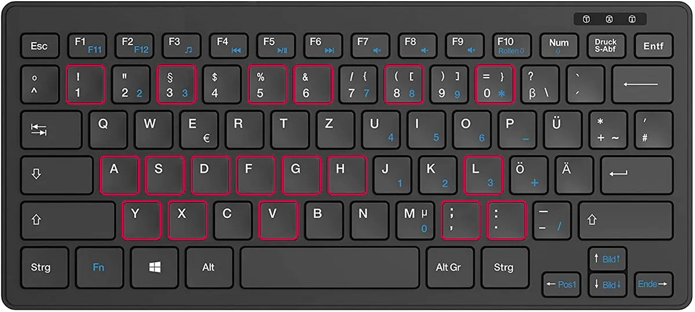

# Indicators and EA Snippets for MetaTrader 5

 

> :warning: MT4 abandoned. Only the code for MT5 is up to date and gets further updates.

 

Some MT5 indicators and tools I use for my trading. Feel free to contribute improvements and let me know your ideas.

My major developments are the **[Trade Manager](/Trade%20Manager/Trade%20Manager.mq5)**, a **[Currency Strength indicator](/Currency%20Index/CurrencyStrength.mq5)** and a **[Pivot Points indicator](/Pivots/MultiPivots.mq5)**. A special facility allows for up to 20 times faster backtesting of currency strength related strategies. A SQLite database is used to **[build up a store of currency strength data](/EA%20Snippets/CurrencyStrength/CurrencyStrengthWrite3.mq5)**. This database can then be used for backtesting with the **[Trade Manager](/Trade%20Manager/Trade%20Manager.mq5)**, or any other tool, without time consuming calculations.

For those who want to install everything in one shot, I have added a zip file of my **[entire MQL5 content](/MQL5%20Entire%20Content)**. Just install a new MT5 terminal and replace the folder MQL5 with the content of the zip file. In options, charts, set max bars to 1000000, some tools need this.

 

 
 

## Trade Manager Keys

### <code>Ctrl</code> Activates and Deactivates the Command Mode

   Keys in Command Mode:
   
   **<code>1</code>** Open a Buy Trade 
   **<code>3</code>** Open a Sell Trade 
   **<code>5</code>** Activate/Deactivate Hard Single Break Even Mode 
   **<code>6</code>** Activate/Deactivate Soft Basket Break Even Mode 
   **<code>8</code>** Activate/Deactivate Close Basket at Break Even 
   **<code>0</code>** Close all Trades 
   **<code>,</code>** Decrease Trade Volume 
   **<code>.</code>** Increase Trade Volume 
   **<code>A</code>** Decrease Stop Loss 
   **<code>S</code>** Increase Stop Loss 
   **<code>D</code>** Decrease Take Profit 
   **<code>F</code>** Increase Take Profit 
   **<code>X</code>** Toggle Currency to open Buy/Sell Bag (7 Trades) 
   **<code>Y</code>** Reset open Buy/Sell Bag to current Pair 
   **<code>V</code>** Toggle View of opened Trades by Pairs or Currencies 
   **<code>L</code>** Toggle Lipstick (Drawings of Asia Range and NY Open) 

   
### <code>Shift</code> Activates and Deactivates the Single Trade Management Mode

   Keys in Single Trade Management Mode:

   **<code>A</code>** Decrease Stop Loss 
   **<code>S</code>** Increase Stop Loss 
   **<code>D</code>** Decrease Take Profit 
   **<code>F</code>** Increase Take Profit 
   **<code>G</code>** Activate Previous Trade 
   **<code>H</code>** Activate Next Trade 

 
 

MT5 uses the key codes not the characters. The characters listed here are based on this QWERTZ keyboard layout. If your keyboard layout is different, be sure you use the same keys, not the corresponding characters.

 

 
 

## Trade Manager Sample, Setup a Basket with balanced Risk

 
 

## Trade Manager Aggregated View and Close of Trades

 
 

## Trade Manager Add Pending Orders with Drag and Drop and Proper Risk

 
 

## Forex Currency Strength Analysis Tool

 
 

## Seconds Charts for MetaTrader 5

 
 

## Synchronized Chart Scroll and Session Marking for MetaTrader 5

 
 

## Trade Copier Service for Trade Manager for MetaTrader 5

